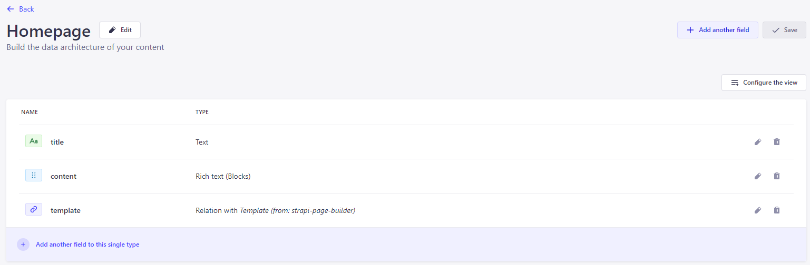

<div align="center">
   
</div>
<h1 align="center">Page Builder</h1>
<p align="center">Visual, drag and drop page editor for Strapi.</p>
<p align="center">Connect Page Builder to your web site and start editing your own custom components, visually.</p>

<br />

<p align="center">
  <a href="https://www.npmjs.com/package/@wecre8websites/strapi-page-builder">
    
  </a>
  <a href="https://www.npmjs.org/package/@wecre8websites/strapi-page-builder">
    
  </a>
</p>

<br>

 <br/>

<br/><br/>

## Documentation

Read the complete documentation at https://pagebuilder.wc8.io

## Page Builder plugin for Strapi

[Strapi](https://strapi.io/) is the leading open-source headless Content Management System. It’s 100% JavaScript, fully customizable and developer-first.

## Visually edit and build your site using Strapi content and custom componets

The Page Builder plugin adds a visual page editor to Strapi, leting you drag and drop custom sections and connect them to CMS data.

Setting up Page Builder is quick and easy.

1. Sign up for a free Page Builder API key at https://pagebuilder.wc8.io
1. Add the companion [@wecre8websites/strapi-page-builder-react](https://www.npmjs.com/package/@wecre8websites/strapi-page-builder-react) package to your React app configure an editor URL.
1. Add the new template relation field to one or more of your Strapi content types.
1. Configure the Page Builder plugin with your API key, Editor URL and select the default content type and content.
1. Open Page Builder from the sidebar menu and start building custom templates.

<br/><br/>

## ✨ Features

1. Quick installation and setup.
1. Build custom components that can be reused in any template.
1. Add, remove, change, drag and drop components and sections with an easy to use interface.
1. Connect your CMS data and use it in your custom components with no additional coding.
1. Reuse templates and fill them with dynamic data. 
1. Use Strapi's Role-based access control to restrict permissions to only content editors.
1. Allows non-technical users to manage and update content quickly and easily.

<br/><br/>

## 🖐 Requirements

The requirements to install the Page Builder plugin is the same as those to install Strapi.

Please refer to the official Strapi installation requirement doc here: [Installation Requirements](https://docs.strapi.io/dev-docs/intro).

**Minimum environment requirements**

- Node.js `>=18.x.x`
- NPM `>=8.x.x`

We are following the [official Node.js releases timelines](https://nodejs.org/en/about/releases/).

**Supported Strapi versions**:

- Strapi v5.x

> The Page Builder plugin is designed for **Strapi v5.x**. It has not been tested with previous versions.

<br/><br/>

## ⏳ Installation

Use **npm** to install this plugin within your Strapi project.

[Refer to this doc to install npm](https://docs.npmjs.com/cli/v6/commands/npm-install)

```bash
$ npm install @wecre8websites/strapi-page-builder
$ npm run build
$ npm run develop
```

The **Page Builder** plugin should appear in the Strapi sidebar after you run the app again.

<br/><br/>

## 🔧 Configuration

You can easily configure the Page Builder plugin to connect to your website.

- Go to ` Settings -> Global Settings -> Page Builder `.
- On the settings page, Enter your API key and website's Page Builder URL, then choose your default content type and content.
- Click on Save and check the connection.

<br/><br/>

<br/><br/>

<br/>

## Permissions

Configure user roles to allow or limit access to Page Builder

- To allow a role to view or change the template assigned to a content type, add the ` Template -> Read ` permission.

- Choose whether the use can view, edit content only or add and remove components from templates.

- Allow or restrict access to Page Builder settings


<br/><br/>

<br/>

## Configure content types

After configuring Page Builder, you must add a template relation field to any content type you want to use with Page Builder.

1. Click on **Content-Type Builder** from the Strapi sidebar.
1. Choose a content type to modify. Both collection types and single types can be used
1. Add a relation field to the content type

1. Choose **Template (from: strapi-page-builder)** in the drop down menu and ensure the relation is set to **has one Template**. Give your field a name, such as "template".

1. Click on finish.


<br/>

## Add the companion package to your React website

For the Page Editor plugin to be able to connect to your site, you must add the companion [@wecre8websites/strapi-page-builder-react](https://www.npmjs.com/package/@wecre8websites/strapi-page-builder-react) package to your React app configure an editor URL.


## 📝 License

[MIT License](LICENSE.md)

Copyright © 2025 [wecre8websites](https://www.wecre8websites.com)